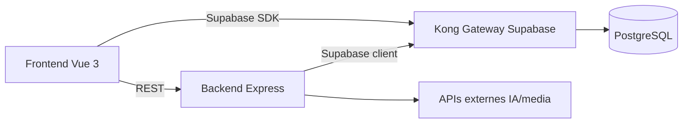

# Meubly

## Description

**Meubly** est une application de comparaison et de recherche de meubles.
Le projet combine :
- un frontend **Vue 3** pour l'experience utilisateur ;
- un backend **Express.js** pour la logique metier ;
- une stack **Supabase self-hosted** pour l'authentification, les donnees, le realtime et le storage ;
- des integrations IA/media (Gemini, Replicate, OpenRouter, Unsplash) pour l'enrichissement de contenu.

---

## Architecture



Documentation detaillee :
- `docs/diagrams/architecture.md`

---

## Stack technique

| Couche | Technologies | Usage |
|---|---|---|
| Frontend | Vue 3, Vite, Pinia, PrimeVue, Tailwind | Interface utilisateur |
| Backend | Node.js, Express, Zod, JWT, Vitest | API metier |
| Data Platform | Supabase self-hosted (Kong, Auth, REST, Realtime, Storage) | Auth + donnees + API |
| Base de donnees | PostgreSQL 15 | Stockage relationnel |
| Ingestion | Service `bd/ingestion` (CRON, CSV/JSON, IKEA adapter) | Import de donnees |
| Qualite | SonarQube Community, Vitest, Cypress | Analyse qualite + tests |
| Email dev | Mailpit | Sandbox SMTP locale |

---

## Prerequis

- Node.js 20+ recommande
- npm 10+
- Docker Desktop + Docker Compose v2

---

## Configuration environnement

Depuis la racine du projet :

```bash
cp .env.example .env
```

Puis renseigner les variables importantes dans `.env` :
- Supabase (`ANON_KEY`, `SERVICE_ROLE_KEY`, `JWT_SECRET`, etc.)
- APIs externes (`GEMINI_API_KEY`, `REPLICATE_API_TOKEN`, `OPENROUTER_API_KEY`, `UNSPLASH_ACCESS_KEY`)
- SonarQube (optionnel : `SONAR_PORT`, `SONAR_DB_*`)

---

## Demarrage rapide (sans Docker pour front/back)

### 1) Backend

```bash
cd meubly-back
npm install
npm run dev
```

Backend disponible sur `http://localhost:5000`.

### 2) Frontend

```bash
cd meubly-front
npm install
npm run dev
```

Frontend disponible sur `http://localhost:5173`.

---

## Demarrage Docker

### Profils disponibles

Le `docker-compose.yml` utilise des profils pour isoler les services optionnels :

| Profil | Services activés | Commande |
|---|---|---|
| *(aucun)* | Stack Supabase + `meubly-back` + `meubly-front` | `docker compose up -d --build` |
| `app` | Uniquement front/back en hot reload (override dev) | `docker compose --profile app -f docker-compose.yml -f docker-compose.dev.yml up -d --build` |
| `ingestion` | + service `ingestion` (CRON IKEA/CSV) | `docker compose --profile ingestion up -d ingestion` |
| `sonar` | + `sonarqube` + `sonarqube_db` | `docker compose --profile sonar up -d` |

### Option A - Stack complete (mode "production-like")

```bash
docker compose up -d --build
```

### Option B - Mode developpement app (hot reload front/back)

```bash
docker compose --profile app -f docker-compose.yml -f docker-compose.dev.yml up -d --build
```

Ce mode utilise (`docker-compose.dev.yml`) :
- `nodemon` pour `meubly-back`
- `vite --host 0.0.0.0 --port 5173` pour `meubly-front`
- `CHOKIDAR_USEPOLLING=true` pour la detection de changements sous Windows
- bind mounts de code source pour edition en direct sans rebuild

Suivre les logs en mode dev :

```bash
docker compose -f docker-compose.yml -f docker-compose.dev.yml logs -f meubly-back
docker compose -f docker-compose.yml -f docker-compose.dev.yml logs -f meubly-front
```

Arreter le mode dev :

```bash
docker compose -f docker-compose.yml -f docker-compose.dev.yml down
```

### Verifier l'etat des services

```bash
# Etat de tous les conteneurs (nom, image, ports, statut)
docker compose ps

# Sante des services Supabase (healthcheck)
docker compose ps --format "table {{.Name}}\t{{.Status}}\t{{.Ports}}"
```

Noms de conteneurs utiles :

| Conteneur | Role |
|---|---|
| `back` | API Express Meubly |
| `front` | Frontend Vue 3 |
| `supabase-db` | PostgreSQL 15 |
| `supabase-kong` | API Gateway Supabase |
| `supabase-auth` | GoTrue (authentification) |
| `supabase-rest` | PostgREST (API auto) |
| `supabase-realtime` | Websockets temps reel |
| `supabase-storage` | Stockage de fichiers |
| `supabase-studio` | Interface Supabase Studio |
| `supabase-analytics` | Logflare (logs) |
| `supabase-pooler` | Supavisor (pooler PG) |
| `mailpit` | Sandbox SMTP locale |
| `ingestion` | Service import donnees |
| `sonarqube` | Analyse qualite code |

### Logs par service

```bash
# Logs globaux en temps reel
docker compose logs -f

# Logs d'un service specifique
docker compose logs -f meubly-back
docker compose logs -f meubly-front
docker compose logs -f db          # PostgreSQL
docker compose logs -f kong         # API Gateway
docker compose logs -f auth         # Authentification
docker compose logs -f storage      # Stockage
docker compose logs -f analytics    # Logflare
```

### Rebuild cible

```bash
# Rebuild uniquement le backend
docker compose up -d --build meubly-back

# Rebuild uniquement le frontend
docker compose up -d --build meubly-front

# Redemarrer un service sans rebuild
docker compose restart meubly-back
docker compose restart meubly-front
```

### Stopper / Nettoyer

```bash
# Stopper la stack (conserve les volumes et donnees)
docker compose down

# Stopper et supprimer les conteneurs orphelins
docker compose down --remove-orphans

# Reset complet : supprime volumes (DB, Storage, Analytics)
docker compose down -v
```

### Repartir d'une base propre

> **Attention :** supprime toutes les donnees locales (PostgreSQL, Storage, etc.)

```bash
docker compose down -v
docker compose up -d --build
```

Sur base fraiche, le schema Meubly est automatiquement initialise via :
- `bd/supabase/full_schema_model.sql` (monte dans `docker-entrypoint-initdb.d`)

> Le premier demarrage peut prendre 1 a 2 minutes (init schema + migrations Supabase).
> Surveiller la sante du service `db` : `docker compose logs -f db`

### Acces shell dans un conteneur

```bash
# Shell dans le backend (Express)
docker compose exec -it back sh

# Shell PostgreSQL (psql)
docker compose exec -it supabase-db bash
# puis : psql -U postgres -d postgres

# Shell dans Kong (debug config)
docker compose exec -it supabase-kong sh
```

### Flux Git quotidien (pull/push)

```bash
# 1) Recuperer les dernieres modifications
git pull

# 2) Rebuild si Dockerfiles ou dependances ont change
docker compose up -d --build

# 3) Verifier l'etat des services
docker compose ps

# 4) Pousser vos changements (workflow classique)
git checkout -b feat/<ma_feature>
git add .
git commit -m "feat: <description courte>"
git push -u origin feat/<ma_feature>
# Ouvrir une Pull Request sur GitHub
```

### Problemes frequents

| Symptome | Cause probable | Solution |
|---|---|---|
| `supabase-db` ne passe pas `healthy` | Premier init lent ou schema en erreur | `docker compose logs -f db` ; attendre 2 min |
| `kong` ne demarre pas | `analytics` pas encore healthy | Relancer : `docker compose restart kong` |
| Port `5000` ou `5173` deja utilise | Autre processus sur le port | `docker compose down` puis verifier avec `netstat -ano` |
| Hot reload inactif sous Windows | Polling desactive | S'assurer que `CHOKIDAR_USEPOLLING=true` est present dans le dev override |
| `AUTH_JWT_SECRET` manquant | `.env` incomplet | Copier `.env.example` vers `.env` et renseigner les cles |
| Image storage inaccessible | `imgproxy` pas demarree | `docker compose up -d imgproxy storage` |

---

## Ingestion de donnees

Le service `ingestion` tourne avec le profil `ingestion`.

### Lancer l'ingestion en service

```bash
docker compose --profile ingestion up -d ingestion
```

### Run unique (batch manuel)

```bash
docker compose --profile ingestion run --rm -e RUN_ONCE=true ingestion
```

### Logs ingestion

```bash
docker logs -f ingestion
```

Notes IKEA :
- Par defaut, tentative en guest token
- Si `401 Unauthorized`, definir `IKEA_TOKEN` dans `.env`
- Activer `IKEA_DEBUG=true` pour investiguer le parsing

---

## Qualite de code (SonarQube)

SonarQube est integre dans `docker-compose.yml` avec le profil `sonar`.

### Demarrer SonarQube

```bash
docker compose --profile sonar up -d
```

UI SonarQube :
- `http://localhost:9000` (premiere connexion : `admin` / `admin`)

### Config de scan

- `meubly-back/sonar-project.properties`
- `meubly-front/sonar-project.properties`

### Analyse backend (exemple)

```bash
cd meubly-back
npm run test:coverage

# depuis la racine du repo (PowerShell)
$env:SONAR_TOKEN="VOTRE_TOKEN"
$p=(Get-Location).Path
docker run --rm `
  -e SONAR_HOST_URL="http://host.docker.internal:9000" `
  -e SONAR_TOKEN=$env:SONAR_TOKEN `
  -v "$p/meubly-back:/usr/src" `
  sonarsource/sonar-scanner-cli:latest
```

---

## URLs locales utiles

| Service | URL |
|---|---|
| Frontend | `http://localhost:5173` |
| Backend API | `http://localhost:5000/api/v1` |
| Supabase Gateway (Kong) | `http://localhost:8000` |
| Supabase Studio | `http://localhost:3000` |
| Mailpit UI | `http://localhost:8025` |
| SonarQube | `http://localhost:9000` |

---

## Commandes utiles

```bash
# Etat des conteneurs (tous, pas seulement ceux du compose)
docker ps

# Etat des conteneurs du projet uniquement
docker compose ps

# Logs globaux en temps reel
docker compose logs -f

# Logs d'un service specifique
docker compose logs -f meubly-back
docker compose logs -f meubly-front

# Rebuild uniquement le backend
docker compose up -d --build meubly-back

# Rebuild uniquement le frontend
docker compose up -d --build meubly-front

# Redemarrer un service (sans rebuild)
docker compose restart meubly-back

# Stopper la stack (donnees conservees)
docker compose down

# Nettoyer les conteneurs orphelins
docker compose down --remove-orphans

# Reset complet (supprime les volumes, donc la DB locale)
docker compose down -v

# Inspecter les variables d'environnement d'un service
docker compose exec back env | sort

# Statistiques ressources en temps reel
docker stats
```

---

## Base de donnees et SQL

- Les scripts SQL sont dans `bd/supabase/`.
- Sur base fraiche (`docker compose down -v`), le schema initial Meubly est initialise via :
  - `bd/supabase/full_schema_model.sql`

---

## Tests

### Backend

```bash
cd meubly-back
npm run test
npm run test:run
npm run test:coverage
```

### Frontend

```bash
cd meubly-front
npm run test
npm run test:run
npm run test:coverage
npm run test:e2e
```

---

## Documentation projet

| Document | Description |
|---|---|
| `docs/diagrams/architecture.md` | Architecture globale detaillee |
| `docker-compose.yml` | Stack principale (Supabase, app, sonar, ingestion) |
| `docker-compose.dev.yml` | Overrides dev pour front/back en hot reload |
| `meubly-back/sonar-project.properties` | Configuration Sonar backend |
| `meubly-front/sonar-project.properties` | Configuration Sonar frontend |
