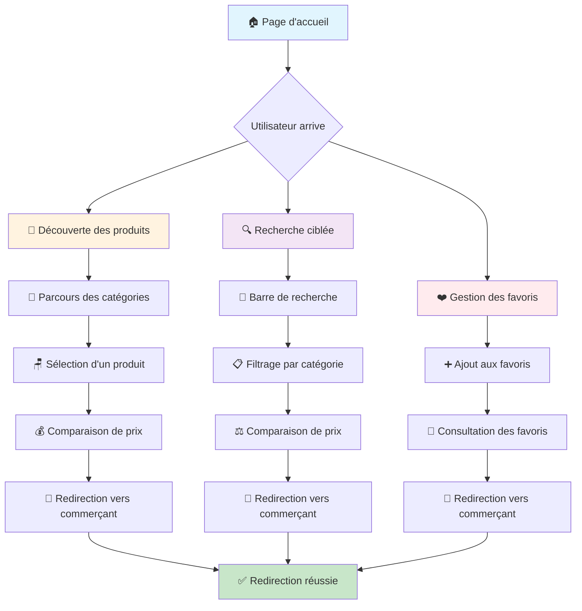
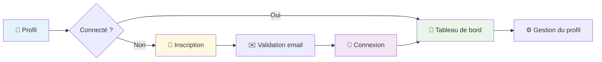
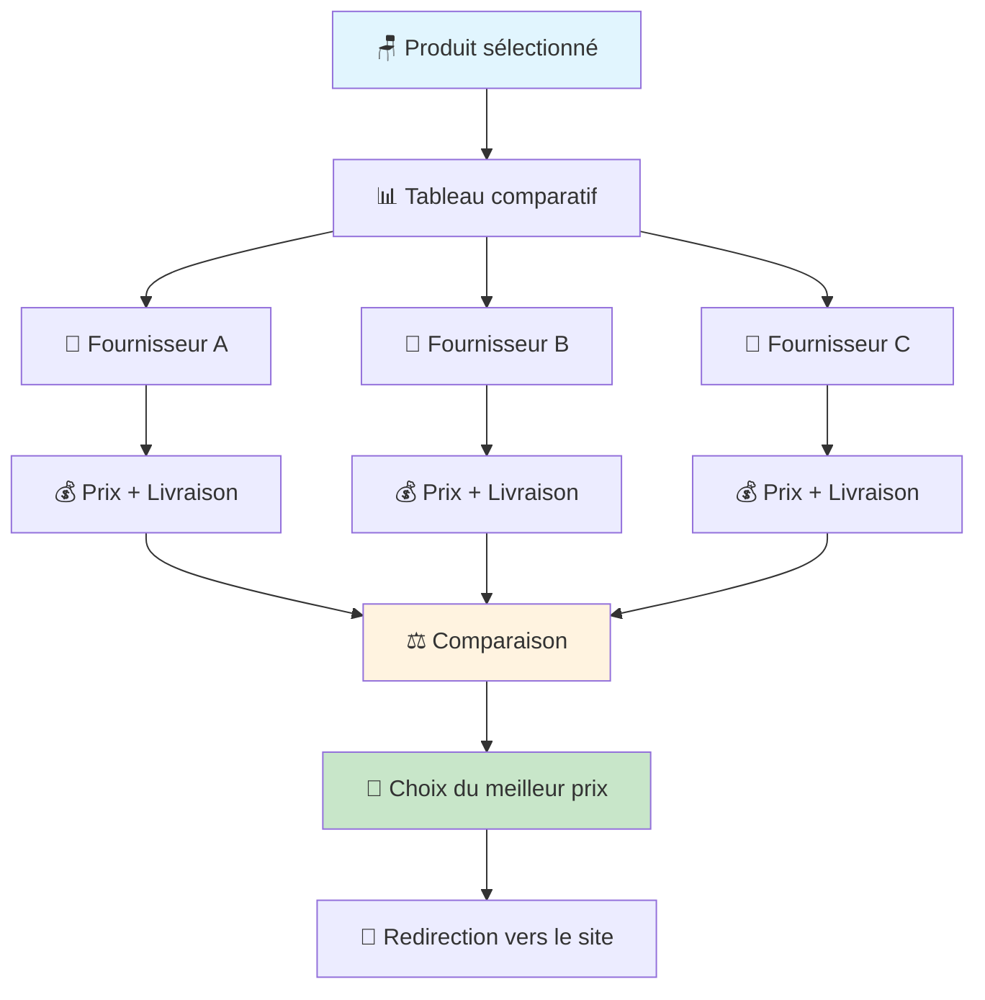

# 🗺️ **Parcours Utilisateur - Application Meubly**

## 📊 **Schéma du parcours utilisateur principal**



## 🎯 **Détail des parcours**

### **1. 🚀 Découverte des produits**
```
Accueil → Parcours des catégories → Sélection d'un produit
```

**Étapes détaillées :**
- **Page d'accueil** : Affichage des produits populaires et tendances
- **Navigation par catégories** : Canapés, Tables, Chaises, Armoires, etc.
- **Exploration visuelle** : Parcours des cartes produits avec images
- **Sélection** : Clic sur un produit d'intérêt

### **2. 🔍 Recherche ciblée**
```
Barre de recherche → Filtrage par catégorie → Comparaison de prix
```

**Étapes détaillées :**
- **Saisie de recherche** : Terme de recherche dans la barre
- **Filtrage intelligent** : Suggestions et autocomplétion
- **Résultats filtrés** : Affichage par catégorie et prix
- **Comparaison** : Tableau comparatif des fournisseurs

### **3. ❤️ Gestion des favoris**
```
Ajout aux favoris → Consultation des favoris → Achat direct
```

**Étapes détaillées :**
- **Ajout** : Clic sur l'icône cœur sur une carte produit
- **Organisation** : Page dédiée aux favoris
- **Gestion** : Suppression, organisation par catégorie
- **Conversion** : Accès direct aux sites d'achat

## 🔄 **Parcours secondaires**

### **A. Authentification utilisateur**


### **B. Comparaison de prix**


## 📱 **Parcours responsive**

### **Mobile (< 768px)**
```
Menu hamburger → Navigation → Recherche → Produits → Détail
```

### **Tablette (768px - 1024px)**
```
Navigation étendue → Recherche + Filtres → Grille produits → Détail
```

### **Desktop (> 1024px)**
```
Navigation complète → Recherche avancée → Grille large → Détail + Comparaison
```

## 🎨 **Éléments d'interface clés**

### **Points de contact principaux :**
- 🔍 **Barre de recherche** : Point d'entrée principal
- 🏠 **Logo/Accueil** : Retour facile à la page d'accueil
- ❤️ **Favoris** : Accès rapide aux produits sauvegardés
- 👤 **Profil** : Gestion du compte utilisateur
- 🛒 **Panier** : Suivi des achats (futur)

### **Éléments de conversion :**
- **Boutons CTA** : "Comparer", "Voir les prix", "Ajouter aux favoris"
- **Liens de redirection** : Boutons vers les sites des commerçants
- **Notifications** : Alertes sur les prix et promotions
- **Suggestions** : Produits similaires et recommandations

## 📈 **Métriques de parcours**

### **Objectifs de conversion :**
- **Taux de visite** : 100% (page d'accueil)
- **Taux d'engagement** : > 60% (clics sur produits)
- **Taux de recherche** : > 40% (utilisation de la barre)
- **Taux de favoris** : > 25% (ajout aux favoris)
- **Taux de redirection** : > 15% (clics vers sites des commerçants)

### **Points de friction identifiés :**
- **Chargement des images** : Optimisation requise
- **Navigation mobile** : Amélioration de l'ergonomie
- **Processus d'inscription** : Simplification nécessaire
- **Comparaison de prix** : Interface à optimiser

---

**Ce schéma illustre le parcours utilisateur optimisé pour maximiser l'engagement et la conversion sur la plateforme Meubly.**
